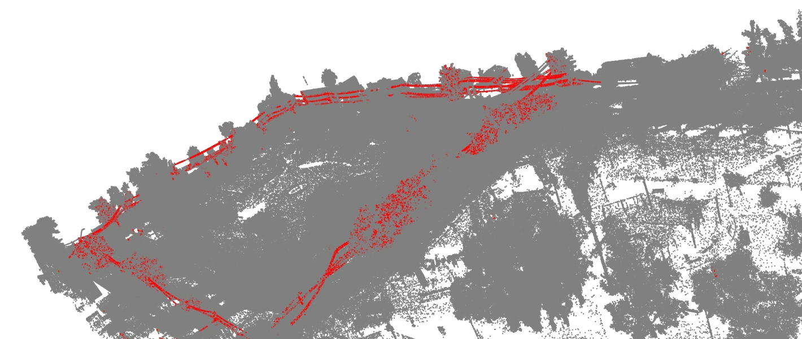

En las ciudades, entre el hormigón y el vidrio, se esconde un entramado de nervios eléctricos que pocos ven pero todos necesitamos. Son las venas de la ciudad moderna: cables que serpentean sobre nuestras cabezas como ríos invisibles. Pero ¿cómo encontrar estos hilos fantasma en un océano de datos? Esta es la crónica de cómo convertí 75 millones de puntos LiDAR en un mapa del tesoro eléctrico, armado solo con Python, física básica, y una dosis de terquedad técnica.

# Acto I: El Mapa que no Podíamos Leer  
*"Tengo los datos brutos de un LiDAR terrestre", me dijeron. "Pero cuidado: son 75 millones de puntos sin clasificar".*  

La primera vez que abrí el archivo LAS, fue como ver una tormenta de nieve digital: millones de puntos blancos bailando en 3D. Sin etiquetas, sin pistas. Solo coordenadas (X,Y,Z) e intensidad de retorno láser.  

**El dilema inicial:**  
- Mi PC tosió al intentar procesar y visualizar 7.5 GB de datos, dado a que para poder realizar la grafica con pyvista debia duplicar el espacio utilizado en RAM    
- *Solución hacker:* Un subsampling agresivo al 10%, como tomar una radiografía reducida pero diagnóstica  

**Primer descubrimiento:**  
Al visualizar el perfil vertical, apareció un vacío misterioso entre 5-6 metros de altura. *¿Zona de exclusión aérea?* No: era el corredor donde vuelan los cables de media tensión, según confirmé con normativas técnicas.  

# Acto II: El Filtro de los Tres Pasos  

## 1. La Altura de los Elegidos  
Recorté la nube al rango 5 a 8 [m], eliminando  gran parte de los puntos. Lo que quedó fue un sandwich aéreo: ramas de árboles, señales de tráfico... y fantasmas de cables.  

**Problema:** Los árboles urbanos son saboteadores naturales. Sus ramas invadían nuestra zona de interés como maleza digital.  

## 2. El Secreto de la Intensidad  
Aquí entró en juego el *ADN LiDAR*: la intensidad del retorno láser. Descubrí que:  
- **Hojas:** Reflejan mucho (alta intensidad) por su superficie rugosa  
- **Cables:** Absorben más (baja intensidad) por material negro que los recubre  

Al filtrar por intensidad < 24.600, eliminé el 60% de la vegetación residual. Pero persistían impostores: tubos metálicos, vallas publicitarias...  

## 3. El Ritmo de los Fantasmas Lineales

Los cables no solo flotan: dibujan patrones en el aire. Usé una combinación letal:

DBSCAN como detector de grupos sospechosos:
- "¿Tienes al menos 10 cómplices cercanos?" → Solo grupos densos pasaban el filtro
- "¿Formas una estructura coherente?" → Eliminaba puntos huérfanos y ruido

PCA como juez geométrico (mi Sherlock Holmes digital):
- A cada grupo de puntos le pedía explicar su forma con una sola línea recta
- Si más del 85% de su esencia cabía en esa línea era un cable
- Los impostores (ramas, postes) fallaban el test por ser muy "tridimensionales"

#  ACTO III: Lo que Aprendí en la Caza

1. **Los datos crudos son diamantes en bruto** – sin clasificar, pero llenos de patrones para quien sepa mirar  
2. **La física siempre gana** – la catenaria no miente, ni la reflectividad de los materiales  
3. **La elegancia está en la simplicidad** – a veces filtros básicos + geometría superan a redes neuronales complejas  

## ¿Qué podria seguir? 
- Entrenar un modelo de ML con nuestros hallazgos como dataset  
- Combinar con cámaras térmicas para validación en campo  
- Automatizar la detección para mantenimiento predictivo  

## Última línea  
Esta no es solo una historia de cables y algoritmos. Es recordatorio de que lo invisible gobierna nuestro mundo... y que con datos y persistencia, hasta los fantasmas urbanos pueden ser domesticados.  

*¿Qué otros secretos esconden tus datos?*  

::github_folder{repo="yeriel/tutorials" folder="lidar"}
